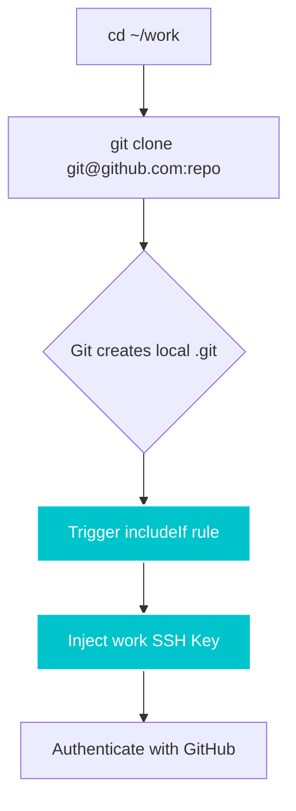

<div align="center">

# GitSetu 
*(git · se · tu)* / Sanskrit: bridge

**The bridge between your identities and your repositories.**  
*Zero deps. No daemon. Pure bash.*

[](.github/workflows/ci.yml)
[](https://www.shellcheck.net/)
[](LICENSE)
[](https://www.gnu.org/software/bash/)
[]()

<br/>

</div>

---

## 01. The Problem

**Wrong author commits**
You push a freelance project and your work email shows up in the git log. Your client sees your employer's domain.

**SSH key collisions**
One SSH key for three GitHub accounts means GitHub can't tell who you are. Pushes fail, permissions break.

**Manual global config**
You edit `~/.gitconfig` before every context switch. Then you forget. Again.

**Heavy tooling**
Every solution requires Node, Python, or a background daemon watching your filesystem. Just to change a name.

---

## 02. How GitSetu Works

GitSetu automatically manages multiple Git identities and SSH keys on a single machine. It provisions distinct keys, injects directory-based conditional configs, and writes SSH host aliases — so you never accidentally commit as the wrong author ever again.

1. **You declare an identity:** Run `gitsetu add`. Name, email, directory scope.
2. **GitSetu provisions a dedicated SSH key:** Generates a unique ED25519 SSH keypair cleanly stored under `~/.ssh/gitsetu/`. No shared keys between accounts.
3. **Writes a scoped `~/.gitconfig` include:** Injects an `includeIf` block that activates your name and email — only inside that directory tree.
4. **Creates an SSH host alias:** Writes a `Host` block in `~/.ssh/config`. 

### The "Magical Clone" Workflow
Other tools require you to memorize custom SSH host aliases (`git clone git@github-work:repo.git`). We reject this. With GitSetu, you just clone normally. Git's native `includeIf` intercepts the clone mid-flight and injects the correct key.



---

## 03. Quick Start

**1. Install GitSetu:**
```bash
curl -sL https://raw.githubusercontent.com/bhaskarjha-com/gitsetu/main/install.sh | bash
```
> **Note:** The installer creates a `git-setu` alias, meaning you can run GitSetu natively as `git setu`!

**2. Add your identities once:**
```bash
$ gitsetu add personal "Aditya Kumar" aditya@gmail.com ~/personal
$ gitsetu add work "Aditya Kumar" aditya@company.com ~/work
$ gitsetu add freelance "AK Dev" ak@freelance.io ~/clients
```
*(Prefer a guided setup? Just run `gitsetu setup` to launch the interactive TUI).*

**3. Verify your setup:**
```bash
$ git setu status
personal aditya@gmail.com ~/personal ✓ active
work aditya@company.com ~/work
freelance ak@freelance.io ~/clients
```

**4. From now on — just `cd` and work. GitSetu does the rest.**
```text
$ cd ~/work/my-api && git commit -m "fix: auth bug"
Author: Aditya Kumar <aditya@company.com> ← correct, automatically
```

> **Pro Tip: Setting a Global Fallback**  
> By default, GitSetu enforces maximum security. If you commit outside a mapped directory, Git will intentionally block you to prevent identity leakage (`useConfigOnly = true`). 
> If you *want* a global fallback (e.g., use your personal email everywhere by default), simply edit that profile and set its directory to your home folder (`~/`). Git's path-matching will treat it as a catch-all fallback, while more specific directories (like `~/work`) will safely override it!

---

## 04. What You Get

- **zero dependency:** Pure Bash. No Node. No Python. No package manager.
- **no daemon:** GitSetu writes config once and lets Git's native `includeIf` do the switching. Zero background processes. Zero memory footprint.
- **directory-scoped:** Identity follows your cursor. Enter `~/work` — you're your work self.
- **ssh & https isolated:** Each profile gets its own ED25519 keypair and securely vaulted Personal Access Token (PAT) for HTTPS cloning.
- **non-destructive:** Your existing config is safe. GitSetu appends to `~/.gitconfig` and `~/.ssh/config` with clearly marked blocks. Uninstall removes exactly what it added (use `gitsetu teardown --deep` to also strip local repo overrides).
- **open standard:** No lock-in. GitSetu generates standard Git config and standard SSH config. You can read, edit, or delete what it creates.

### Shell Autocompletion
GitSetu provides rich <kbd>TAB</kbd> autocompletion for subcommands and profile names.
Add the following to your `~/.bashrc` or `~/.zshrc`:
```bash
source ~/.local/bin/completion.sh # or the path where gitsetu is installed
```

### Shell Prompt Integration (`$PS1`)
Visual confirmation is critical in zero-trust environments. You can configure your terminal prompt to display your active GitSetu profile (e.g., `[work]`) so you always know who you are before you commit.

Because it is built with 100% native Bash parameter expansion (zero subshells), `gitsetu prompt` executes in under **2 milliseconds**, guaranteeing zero terminal lag.

**Bash (`~/.bashrc`):**
```bash
export PS1='\[\e[36m\]$(gitsetu prompt)\[\e[0m\] \w $ '
```

**Zsh (`~/.zshrc`):**
```zsh
PROMPT='%F{cyan}$(gitsetu prompt)%f %~ $ '
```

### Native Git Credential Broker (HTTPS / PATs)
If your corporate firewall blocks SSH (Port 22), you can use GitSetu's pure-Bash **Git Credential Broker** to manage your Personal Access Tokens (PATs) for HTTPS cloning.

Unlike standard Git credential managers that get confused and return 403 Forbidden errors when you have multiple accounts for the same host (e.g., `github.com`), GitSetu intercepts Git's authentication stream. It instantly detects your active directory context and routes your request to the exact token stored securely in the native OS keychain (macOS `security` or Linux `secret-tool`).

To use this, simply provide a **Provider Username** (e.g. GitHub handle) during `gitsetu setup` and enter your PAT when prompted. GitSetu handles the rest with absolute zero-dependency isolation.

---

## 05. The "Identity Guard"

Ever accidentally pushed a commit to your company repository using your `anime_fan_99@gmail.com` email address? 

GitSetu includes a global pre-commit hook that actively monitors your `$PWD` and blocks commits if your active `user.email` doesn't match the expected profile for that folder.

```bash
# Install the global identity guard
gitsetu guard --install
```

```text
$ git commit -m "fix critical auth bug"

⚠ gitsetu: Identity mismatch detected!
  Expected: engineering@company.com (profile: work)
  Actual:   personal@gmail.com
```

---

## 06. Enterprise Automation & Zero-Trust Architecture

GitSetu is designed from the ground up for highly parallel CI/CD environments and zero-touch `ansible` provisioning, adopting a **strictly secure, Zero-Trust Architecture**:
* **Zero-Trust Pre-Commit Guard & SSOT:** The identity guard enforces a "fail-closed" boundary. If the GitSetu configuration is missing, tampered with, or if the environment's `$HOME` is overridden maliciously, the hook will unconditionally block the commit. To prevent "dual-state" desynchronization, the guard acts as a Single Source of Truth (SSOT), dynamically querying the isolated `.gitconfig` files instead of relying on central registries.
* **Atomic POSIX Locks & Stale Reaping:** Headless profile creation utilizes an atomic `mkdir` directory lock. If a process crashes (`kill -9`), subsequent processes will automatically reap the stale lock via an atomic `mv` swap, perfectly eliminating Time-of-Check to Time-of-Use race conditions and preventing permanent deadlocks.
* **Atomic Filesystem Swaps & Unified Cleanup:** Configuration files are never modified in-place. They are written to a temporary (`mktemp`) file and atomically swapped via `mv`. A unified architecture bound to `EXIT/SIGINT/SIGTERM` ensures that no temporary files or orphaned locks ever leak onto the host machine.

---

## 07. Ecosystem Comparison

| Feature | `gitego` (Go) | `gguser` (Node) | `git-profile` (Rust/JS) | `karn` (Go) | **GitSetu (Bash)** |
|---------|:---:|:---:|:---:|:---:|:---:|
| **Identity Switching** | ✅ | ✅ | ✅ | ✅ | ✅ |
| **Directory-Based Auto Switch** | ✅ | ✅ | ❌ | ✅ | ✅ |
| **SSH Key Generation** | ❌ | ❌ | ❌ | ❌ | ✅ |
| **SSH Config Orchestration** | ❌ | ❌ | ❌ | ❌ | ✅ |
| **Pre-Commit Identity Guard** | ✅ | ❌ | ❌ | ❌ | ✅ |
| **Absolute Zero Dependencies** | ❌ | ❌ | ❌ | ❌ | ✅ |
| **Safe Idempotent Execution** | ❌ | ❌ | ❌ | ❌ | ✅ |

---

## 08. Philosophy

In Sanskrit, *Setu (सेतु)* is the bridge that connects two shores without disturbing either. It doesn't change the shore. It doesn't own the water. It simply makes crossing effortless and reliable.

GitSetu is built on the same principle. It does not replace Git, SSH, or your terminal workflow. It bridges the gap between the developer you are in one directory and the developer you are in another — invisibly, correctly, and without asking anything of you after the first setup.

**A tool that demands your attention has failed. GitSetu succeeds when you forget it exists.**

---

[MIT License](LICENSE) — Created by Bhaskar Jha
