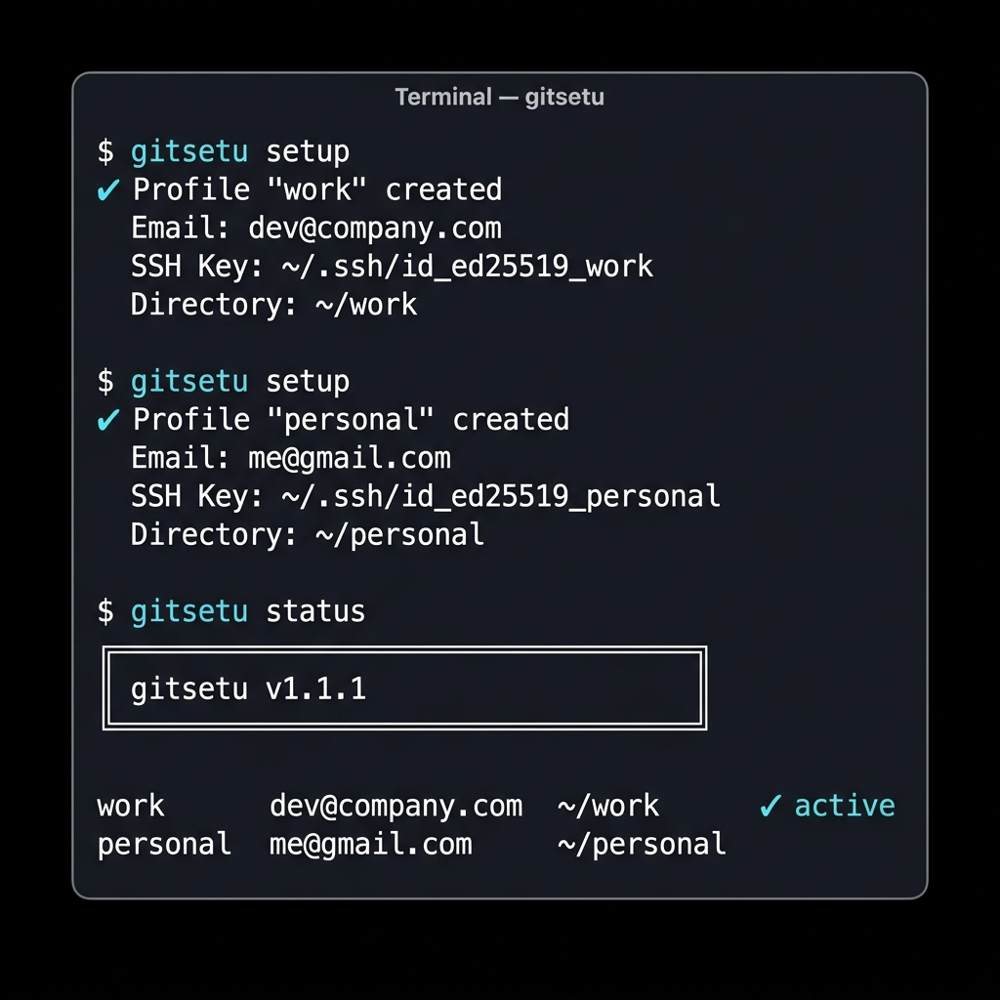
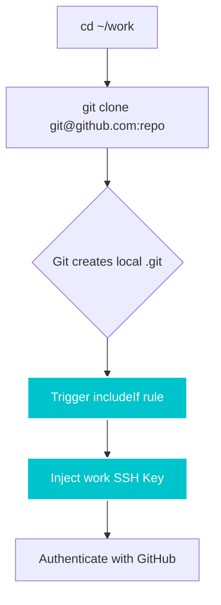

<div align="center">


# GitSetu

**The bridge between your identities and your repositories.**

*Zero deps. No daemon. Pure Bash.*

[](https://github.com/bhaskarjha-com/gitsetu/actions/workflows/ci.yml)
[](https://www.shellcheck.net/)
[](LICENSE)
[](https://www.gnu.org/software/bash/)
[]()
[]()

</div>

<br/>

<p align="center">
  
</p>

<br/>

## Install

```bash
curl -sL https://raw.githubusercontent.com/bhaskarjha-com/gitsetu/main/install.sh | bash
```

> The installer clones the repository to `~/.local/share/gitsetu` and creates a global `git-setu` symlink — run it as `gitsetu` or `git setu`.

---

## Why GitSetu?

| Problem | What happens | GitSetu fix |
|---------|-------------|-------------|
| 🔴 **Wrong author commits** | You push a freelance project and your work email shows up in the log | Directory-scoped `includeIf` auto-switches identity |
| 🔴 **SSH key collisions** | One SSH key for three GitHub accounts — pushes fail silently | Dedicated ED25519 keypair per profile |
| 🔴 **Manual global config** | Edit `~/.gitconfig` before every context switch, then forget | One-time setup, automatic forever |
| 🔴 **Heavy tooling** | Every solution requires Node, Python, or a background daemon | Pure Bash 3.2. Zero dependencies. |

---

## Quick Start

**1. Add your identities:**
```bash
gitsetu setup    # Interactive guided wizard
```

**2. Check your setup:**
```bash
$ gitsetu status
  work       dev@company.com    ~/work      ✓ active
  personal   me@gmail.com       ~/personal
  freelance  ak@freelance.io    ~/clients
```

**3. Just `cd` and work. GitSetu does the rest.**
```text
$ cd ~/work/my-api && git commit -m "fix: auth bug"
Author: Aditya Kumar <dev@company.com> ← correct, automatically
```

> **Global Fallback:** By default, GitSetu enforces `useConfigOnly = true` — commits outside a mapped directory are blocked to prevent identity leakage. Want a catch-all? Set one profile's directory to `~/` and it becomes the fallback.

---

## Features

| | Feature | Description |
|---|---------|-------------|
| 🔑 | **SSH Key Generation** | Dedicated ED25519 keypair per profile (`~/.ssh/id_ed25519_‹label›`) |
| 🔐 | **HTTPS Credential Broker** | Per-profile PAT management via macOS Keychain or Linux `secret-tool` |
| 🛡️ | **Identity Guard** | Pre-commit hook blocks commits if your email doesn't match the directory |
| ⚡ | **2ms Shell Prompt** | `gitsetu prompt` — zero-subshell `$PS1` integration |
| 📦 | **Encrypted Backup** | Export/restore your entire identity state with OpenSSL encryption |
| 🔄 | **Idempotent & Non-Destructive** | Safe to run 100 times. Managed blocks — your custom config is never touched |
| 🖥️ | **Cross-Platform** | Linux, macOS, Windows (Git Bash), WSL — one tool everywhere |
| 🏗️ | **Zero Dependencies** | Pure Bash. No Node, Python, Go, or package managers required |

---

## How It Works

GitSetu provisions a complete Git identity infrastructure from scratch. No manual config editing, no memorizing SSH aliases.



**The "Magical Clone"** — Other tools require custom SSH host aliases (`git@github-work:repo`). GitSetu uses Git's native `includeIf` to intercept clones mid-flight and inject the correct key. You just `git clone` normally. It works.

What GitSetu writes for each profile:
1. **SSH keypair** — `~/.ssh/id_ed25519_‹label›` (unique per profile)
2. **Scoped gitconfig** — `includeIf` block in `~/.gitconfig` for the profile directory
3. **SSH host alias** — `Host` block in `~/.ssh/config`

---

## Identity Guard

Block accidental commits with the wrong identity:

```bash
gitsetu guard --install
```

```text
$ git commit -m "fix critical auth bug"

⚠ gitsetu: Identity mismatch detected!
  Expected: engineering@company.com (profile: work)
  Actual:   personal@gmail.com
```

---

## HTTPS Credential Broker

When SSH (Port 22) is blocked by corporate firewalls, GitSetu's Git Credential Broker manages your PATs per-profile:

- Detects active directory context automatically
- Routes authentication to the correct token
- Stores credentials in the native OS keychain (macOS `security`, Linux `secret-tool`)
- Eliminates 403 errors from multi-account GitHub/GitLab setups

Provide a **Provider Username** during `gitsetu setup` and enter your PAT when prompted.

---

## Shell Integration

### Autocompletion

Rich <kbd>TAB</kbd> completion for subcommands and profile names:
```bash
# Add to ~/.bashrc or ~/.zshrc
source ~/.local/share/gitsetu/lib/completion.sh
```

### Prompt (`$PS1`)

Display your active profile in your terminal prompt — executes in under **2ms** (zero subshells):

**Bash** — add to `~/.bashrc`:
```text
export PS1='\[\e[36m\]$(gitsetu prompt)\[\e[0m\] \w $ '
```

**Zsh** — add to `~/.zshrc`:
```text
PROMPT='%F{cyan}$(gitsetu prompt)%f %~ $ '
```

---

## Encrypted Backup & Restore

Migrate identities to a new machine with OpenSSL-encrypted state export:

```bash
gitsetu backup vault.enc        # Encrypt your entire state
gitsetu restore vault.enc       # Restore on a new machine
```

> **Safety Net:** If an active GitSetu environment is detected on the target machine, `restore` automatically creates a silent pre-flight backup before overwriting.

---

## Ecosystem Comparison

| Feature | `gitego` | `gguser` | `git-profile` | `karn` | **GitSetu** |
|---------|:---:|:---:|:---:|:---:|:---:|
| Identity switching | ✅ | ✅ | ✅ | ✅ | ✅ |
| Directory auto-switch | ✅ | ✅ | ❌ | ✅ | ✅ |
| SSH key generation | ❌ | ❌ | ❌ | ❌ | ✅ |
| SSH config orchestration | ❌ | ❌ | ❌ | ❌ | ✅ |
| HTTPS credential broker | ❌ | ❌ | ❌ | ❌ | ✅ |
| Pre-commit identity guard | ✅ | ❌ | ❌ | ❌ | ✅ |
| Encrypted backup/restore | ❌ | ❌ | ❌ | ❌ | ✅ |
| Shell prompt integration | ❌ | ❌ | ❌ | ❌ | ✅ |
| Zero dependencies | ❌ | ❌ | ❌ | ❌ | ✅ |
| Runtime | Go | Node | Rust/JS | Go | **Bash 3.2** |

---

## Enterprise & CI/CD

GitSetu is built for highly parallel CI/CD environments and zero-touch provisioning:

- **Zero-Trust Pre-Commit Guard** — Fail-closed identity verification. Blocks commits when GitSetu config is missing or tampered with.
- **Atomic POSIX Locks** — `mkdir`-based directory locks with automatic stale lock reaping via atomic `mv` swap.
- **Atomic Config Writes** — Configuration files are written to temp files and atomically swapped via `mv`. No partial writes.
- **Unified Cleanup Architecture** — `EXIT`/`SIGINT`/`SIGTERM` traps ensure zero leaked temp files or orphaned locks.

---

## Uninstallation

```bash
gitsetu teardown --deep          # Remove all config injections
curl -sL https://raw.githubusercontent.com/bhaskarjha-com/gitsetu/main/uninstall.sh | bash
```

> Your generated `~/.ssh/id_ed25519_*` keys are intentionally preserved for safety.

---

## Philosophy

In Sanskrit, *Setu (सेतु)* is the bridge that connects two shores without disturbing either. It doesn't change the shore. It doesn't own the water. It simply makes crossing effortless and reliable.

GitSetu is built on the same principle. It does not replace Git, SSH, or your terminal workflow. It bridges the gap between the developer you are in one directory and the developer you are in another — invisibly, correctly, and without asking anything of you after the first setup.

**A tool that demands your attention has failed. GitSetu succeeds when you forget it exists.**

---

<div align="center">

[MIT License](LICENSE) · Created by [Bhaskar Jha](https://github.com/bhaskarjha-com)

</div>
